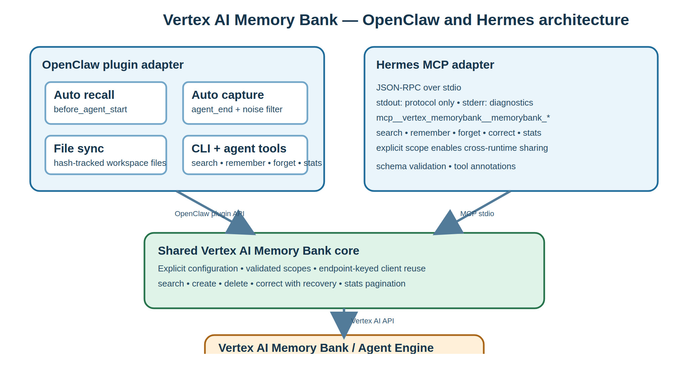

# openclaw-vertexai-memorybank

Managed long-term memory for OpenClaw and Hermes Agent, powered by [Vertex AI Memory Bank](https://docs.cloud.google.com/agent-builder/agent-engine/memory-bank/overview).

### Why you need memory beyond OpenClaw core

OpenClaw's built-in memory is per-agent and per-session. This plugin adds **user-scoped memory that works across all your agents**, so when you tell one agent your preferences, every agent remembers. Scope by user, by project, or however you want. Your agent's memory compounds over time, not resets with each session.

### Why Vertex AI Memory Bank

Fully managed with no vector database to run, no embeddings to maintain, no infrastructure to monitor. Your data stays in your GCP project, private by default. Generous free tier (1,000 retrievals/month free). The extraction and consolidation LLM handles deduplication, contradiction resolution, and fact merging automatically.

### Token-efficient and effective

Memories are extracted facts, not raw conversation logs. Only relevant memories are injected per turn via similarity search, not your entire history. The result: your agent gets better context in fewer tokens.

---



> **Diagram source:** [`architecture.svg`](architecture.svg). Regenerate `architecture.jpg` after diagram changes with a browser SVG screenshot (for example, headless Chromium) followed by PNG-to-JPEG conversion; the rendered JPEG is included for npm/GitHub consumers.

> **Disclaimer**: This is **not** an officially supported Google product.

## What It Does

This plugin gives your OpenClaw agent **persistent, cross-session memory** using Vertex AI Memory Bank:

- **Auto-recall**: Before each turn, relevant memories are retrieved via similarity search and injected into context
- **Auto-capture**: After each turn, the last message pair is sent to Memory Bank for fact extraction and storage
- **Noise filtering**: Short/trivial exchanges are automatically skipped. Few-shot examples teach Memory Bank what to extract vs ignore
- **Relevance threshold**: Low-similarity memories are filtered out before injection, keeping context clean
- **File sync**: Workspace files (MEMORY.md, USER.md, SOUL.md, etc.) are automatically synced to Memory Bank with hash-based change tracking
- **Topic sync**: Memory topics, perspective, and few-shot examples are auto-configured on the Agent Engine instance at startup
- **Agent tools**: Search, forget, correct, and inspect memory stats directly from conversation
- **CLI tools**: Search, create (via consolidation pipeline), and delete memories directly from the command line
- **Managed infrastructure**: No vector DB, no local database. Vertex AI Memory Bank handles storage, embeddings, extraction, and retrieval

> **Note:** This plugin runs _alongside_ OpenClaw's built-in `memory-core`. It adds cloud-backed long-term memory on top.

## Prerequisites

1. **Google Cloud project** with billing enabled and Vertex AI API enabled
2. **Agent Engine instance** created for Memory Bank:
   ```bash
   pip install google-cloud-aiplatform>=1.111.0
   ```
   ```python
   import vertexai
   client = vertexai.Client(project="YOUR_PROJECT", location="us-central1")
   agent_engine = client.agent_engines.create()
   print(agent_engine.api_resource.name)  # Save the reasoning engine ID
   ```
3. **gcloud CLI** authenticated:
   ```bash
   gcloud auth application-default login
   ```

## Installation

### 1. Add plugin config to `openclaw.json`

Add the config **before** installing the plugin. It requires three fields to validate during install:

```json
{
  "plugins": {
    "entries": {
      "openclaw-vertexai-memorybank": {
        "enabled": true,
        "config": {
          "projectId": "your-gcp-project-id",
          "location": "us-central1",
          "reasoningEngineId": "your-reasoning-engine-id"
        }
      }
    }
  }
}
```

### 2. Clone, build, install

```bash
git clone https://github.com/Shubhamsaboo/openclaw-vertexai-memorybank.git
cd openclaw-vertexai-memorybank
npm install && npm run build
openclaw plugins install .
```

### 3. Add to allowlist (recommended)

After install, add `plugins.allow` to your `openclaw.json` to explicitly trust the plugin and silence the "non-bundled plugin auto-load" warning:

```json
{
  "plugins": {
    "allow": ["openclaw-vertexai-memorybank"],
    "entries": { ... }
  }
}
```

> **Why not add `allow` in step 1?** Because OpenClaw checks that allowed plugins are already installed. If you add it before installing, you'll get a validation error.

### 4. Restart

```bash
openclaw restart
```

The plugin loads on gateway startup, so a restart is required after install.

### Bootstrapping from existing sessions

After install, your agent starts with an empty memory. To catch up on context from past conversations, ask your agent:

> *"Generate memories from my last few days of sessions."*

The agent can parse your session history and backfill Memory Bank with extracted facts. This gives you immediate value and your agent will recall decisions, preferences, and context from recent work without waiting for new conversations to build up memory organically.

## Hermes Agent (MCP)

The package also provides a dedicated MCP JSON-RPC-over-stdio server for [Hermes Agent](https://github.com/NousResearch/hermes-agent). It is separate from the OpenClaw plugin: MCP responses are the only data written to stdout; diagnostics go to stderr.

### Install and configure

Build or install the package, then add this entry to `~/.hermes/config.yaml` (Hermes reads stdio servers from `mcp_servers`). Use an absolute package path when using a checkout.

```yaml
mcp_servers:
  vertex_memorybank:
    command: "node"
    args: ["/absolute/path/openclaw-vertexai-memorybank/bin/hermes-mcp.js"]
    env:
      MEMORYBANK_PROJECT_ID: "your-gcp-project-id"
      MEMORYBANK_LOCATION: "us-central1"
      MEMORYBANK_REASONING_ENGINE_ID: "your-reasoning-engine-id"
      # Hermes filters the stdio child environment. Pass service-account ADC explicitly.
      GOOGLE_APPLICATION_CREDENTIALS: "/absolute/path/service-account.json"
      # Alternative to GOOGLE_APPLICATION_CREDENTIALS for user ADC created by
      # `gcloud auth application-default login`:
      # HOME: "${HOME}"
      # Explicitly match OpenClaw's scope to enable cross-runtime sharing.
      MEMORYBANK_SCOPE: '{"user_id":"your-user-id"}'
    trust: untrusted
    tools:
      include:
        - memorybank_search
        - memorybank_remember
        - memorybank_forget
        - memorybank_correct
        - memorybank_stats
```

Hermes supports `${ENV_VAR}` interpolation in MCP config. It deliberately filters the environment of stdio children, so ADC must be deliberate: pass an absolute `GOOGLE_APPLICATION_CREDENTIALS` service-account JSON path, **or** pass `HOME` for user ADC created by `gcloud auth application-default login`. Do not use both unless that precedence is intended. An unset Hermes interpolation stays literal; this server rejects unresolved `${...}` values for required Memory Bank settings. Review and trust the command path before adding it. `trust: untrusted` asks Hermes to require approval for tools that are not marked read-only. Hermes records this stdio server's stderr at `~/.hermes/logs/mcp-stderr.log`.

The tools appear in Hermes as `mcp__vertex_memorybank__memorybank_search` and similarly for the remaining tools. The recommended `tools.include` allow-list limits discovery to the five Memory Bank tools above; include mutating tools only when they are appropriate for the profile.

The server requires these explicit environment variables:

| Variable | Required | Description |
| --- | --- | --- |
| `MEMORYBANK_PROJECT_ID` | yes | GCP project ID or number |
| `MEMORYBANK_LOCATION` | yes | Vertex AI region |
| `MEMORYBANK_REASONING_ENGINE_ID` | yes | Agent Engine reasoning engine ID |
| `MEMORYBANK_SCOPE` | no | JSON object scope; default is `{"agent_name":"hermes"}` |
| `MEMORYBANK_TOP_K` | no | Search result count, integer 1–100 |

The Hermes default scope isolates this runtime. To share memory with OpenClaw, explicitly configure **the identical `scope` object** in OpenClaw and `MEMORYBANK_SCOPE` (for example, `{ "user_id": "your-user-id" }`). Scope matching is exact.

After editing the config, test the server and reload MCP tools:

```bash
hermes mcp test vertex_memorybank
```

```text
/reload-mcp
```

### MCP tools

- `memorybank_search(query, top_k?)`
- `memorybank_remember(fact)`
- `memorybank_forget(memory_id)`
- `memorybank_correct(memory_id, new_fact)`
- `memorybank_stats()`

Malformed JSON-RPC requests and invalid tool arguments return protocol errors or a clean `isError` tool response; no stack traces are sent through the protocol.

## How It Works

```
User message arrives
        |
        v
  [before_agent_start]    Retrieve top-K memories via similarity search,
  (auto-recall)           filter by relevance threshold,
                          prepend to agent context
        |
        v
   Agent processes
   the message
        |
        v
  [agent_end]             Check message length (noise filter)
  (auto-capture)          If substantive: send last message pair
                          to Memory Bank for extraction
        |
  [agent_end]             Scan workspace files for changes
  (file sync)             and sync changed files to Memory Bank
```

- **Recall** uses semantic similarity search scoped to your configured scope. Optional `maxDistance` threshold filters out low-relevance results
- **Capture** sends only the last user+assistant message pair (not the full conversation), so each turn is processed exactly once with zero overlap
- **Noise filter** skips capture when user message < 20 chars or total < 100 chars (filters "done?", "?", "ok" type exchanges)
- **Few-shot examples** teach Memory Bank's extraction LLM what to capture (decisions, preferences) and what to ignore (status checks, debugging chatter)
- **File sync** tracks SHA-256 hashes of workspace files and only re-syncs when content changes
- **Topic sync** auto-configures memory topics, perspective, and few-shot examples on the Agent Engine instance at startup
- **Consolidation** is handled by Memory Bank for generated writes. Conversation capture and file sync use `GenerateMemories` with `direct_contents_source`; direct `memorybank-remember` uses the Memory Bank `CreateMemory` API to store the supplied fact immediately. Generated memories can be deduplicated, updated, or removed by Memory Bank within their exact scope.
- Authentication uses Google Application Default Credentials (ADC)

## Configuration

| Option | Type | Default | Description |
|--------|------|---------|-------------|
| `projectId` | string | **(required)** | GCP project ID or number |
| `location` | string | **(required)** | GCP region (e.g. `us-central1`) |
| `reasoningEngineId` | string | **(required)** | Agent Engine reasoning engine ID |
| `scope` | object | `{"agent_name": "openclaw"}` | Memory scope for isolation. Exact-match on all keys. See [Memory Scoping](#memory-scoping) |
| `autoRecall` | boolean | `true` | Retrieve memories before each turn |
| `autoCapture` | boolean | `true` | Extract memories after each turn |
| `autoSyncFiles` | boolean | `true` | Sync workspace markdown files |
| `autoSyncTopics` | boolean | `true` | Auto-configure topics on startup |
| `memoryTopics` | array | (see below) | Custom memory topics |
| `perspective` | `"first"` \| `"third"` | `"third"` | Memory perspective |
| `topK` | number | `10` | Max memories per query |
| `maxDistance` | number | none | Max similarity distance for recall. Lower = stricter. Memories above this are filtered out |
| `backgroundGenerate` | boolean | `true` | Non-blocking file sync (capture is always async) |
| `ttlSeconds` | number | none | Auto-expire memories (seconds). Default: no expiry |
| `introspection` | `"off"` \| `"scores"` | `"scores"` | Metadata in auto-recalled memories. `"off"` = just facts, `"scores"` = facts + similarity score |

### Default Memory Topics

The plugin configures six topics by default (3 managed + 3 custom):

**Managed:** USER_PREFERENCES, EXPLICIT_INSTRUCTIONS, KEY_CONVERSATION_DETAILS

**Custom:**
- `technical_decisions`: Architecture choices, tool evaluations, technology selections
- `project_context`: Project names, repos, team members, roles, configurations
- `action_items`: Tasks, deadlines, commitments, follow-ups

Each custom topic includes "Do NOT include" clauses to reduce noise (e.g., routine status checks, temporary error messages).

### Few-Shot Examples

The plugin ships with built-in few-shot examples that teach Memory Bank's extraction LLM:

- **What to capture**: User preferences, explicit instructions, architecture decisions
- **What to skip**: Short status checks ("done?"), debugging chatter, operational acknowledgments

You can override these by providing your own `memoryTopics` array with custom few-shot examples.

### Memory Scoping

The `scope` field controls memory isolation. It's an arbitrary key-value object where you define the keys. **Scope matching is exact**: memories are only returned when all scope keys match exactly, and consolidation (dedup, contradiction resolution) only happens within the same scope.

This means scope determines both **who can see** a memory and **what gets merged together**.

**Recommended: scope by `user_id` only** for cross-agent memory sharing:

```jsonc
// Recommended: shared across all agents for the same user
{ "user_id": "shubham" }

// Per-agent (memories won't be shared between agents)
{ "agent_name": "openclaw" }

// Per-user + per-agent (most isolated)
{ "user_id": "shubham", "agent_name": "openclaw" }
```

> **Tip:** If you scope as `{user_id: "alan", agent_name: "zaf"}`, memories created by agent "zaf" won't be found by agent "helper" for the same user. Use `user_id`-only scoping unless you specifically want agent isolation.

Scope is **immutable** once set on a memory, so choose your scoping strategy before backfilling. See the [Memory Bank scoping documentation](https://docs.cloud.google.com/agent-builder/agent-engine/memory-bank/overview#memory-scope) for more details.

## Agent Tools

The plugin registers four tools that the agent can call directly during conversation:

| Tool | Description |
|------|-------------|
| `memorybank_search` | Semantic search that returns facts with similarity scores, topics, timestamps, and memory IDs |
| `memorybank_forget` | Delete a specific memory by ID. Useful when the agent discovers outdated or incorrect information |
| `memorybank_correct` | Update a memory fact with `updateMemory`. When that API is unavailable, it fetches the old fact, deletes, and regenerates; a failed regeneration attempts to restore the old fact and returns any replacement/restored resource name. |
| `memorybank_stats` | Total memory count, breakdown by topic, and scope info. Uses lightweight field-masked counting |

These use `api.registerTool()` and are available to the agent automatically when the plugin is enabled.

**Example interaction:** *"What do you remember about my deployment setup?"* → agent calls `memorybank_search` with that query and gets back ranked results with scores. *"That's wrong, I moved to us-east1"* → agent calls `memorybank_correct` to fix it.

### Introspection

The `introspection` config controls what metadata appears in auto-recalled memories:

- **`"scores"` (default)**: Each memory includes its similarity score, helping the agent weigh relevance
- **`"off"`**: Just the facts, no metadata. Use for token-conscious setups

## CLI Commands

### `memorybank-status`
Show plugin config, connection status, and file sync state.

### `memorybank-search <query> [--top-k N] [--show-ids]`
Search memories by semantic similarity. Shows distance scores. Use `--show-ids` to reveal memory IDs (needed for deletion).
```bash
openclaw memorybank-search "project architecture decisions" --top-k 5 --show-ids
```

### `memorybank-list [--show-ids] [--count-only]`
List all memories in the current scope. Use `--show-ids` to reveal memory IDs. Use `--count-only` for a fast, lightweight count using field-masked API calls (no full memory objects fetched).

### `memorybank-remember <fact>`
Store a fact via Memory Bank's consolidation pipeline (`GenerateMemories` with `direct_memories_source`). The fact goes through the same deduplication, contradiction resolution, and merging as conversation-captured memories, so it's never a raw insert. Useful for cron jobs, scripts, or seeding initial knowledge.
```bash
openclaw memorybank-remember "The deployment uses us-central1 region"
```

### `memorybank-forget <memoryId>`
Delete a specific memory by ID. Find IDs using `--show-ids` with search or list.
```bash
openclaw memorybank-search "wrong fact" --show-ids
# 1. Some incorrect memory (id: 1234567890)

openclaw memorybank-forget 1234567890
```

### `memorybank-sync`
Manually trigger file sync (useful after bulk file edits).

## Pricing

Vertex AI Memory Bank pricing (as of 2026):

| Resource | Cost | Notes |
|----------|------|-------|
| **Memory storage** | $0.25 per 1,000 memories / month | Scales with memory count |
| **Memory retrieval** | $0.50 per 1,000 memories returned | First 1,000/month **free** |
| **Memory generation** | Gemini token costs only (~$0.0003-$0.001/call) | No per-call API fee |

**Example monthly cost (single user, ~50 turns/day):**
- Storage: ~$0.25 (1K memories)
- Retrieval: ~$7 (50 retrievals/day × 30 days, minus free tier)
- Generation: ~$0.50 (capture + file syncs)
- **Total: ~$8/month**

For most personal/small-team usage, costs are minimal. Retrieval is the largest line item at scale, consider caching if you run multiple agents.

See [Vertex AI pricing](https://cloud.google.com/vertex-ai/pricing#vertex-ai-agent-engine) and [FAQ.md](FAQ.md) for detailed cost breakdowns.

## Development

```bash
npm install
npm run build
openclaw plugins install .
```

## License

[MIT](LICENSE)
